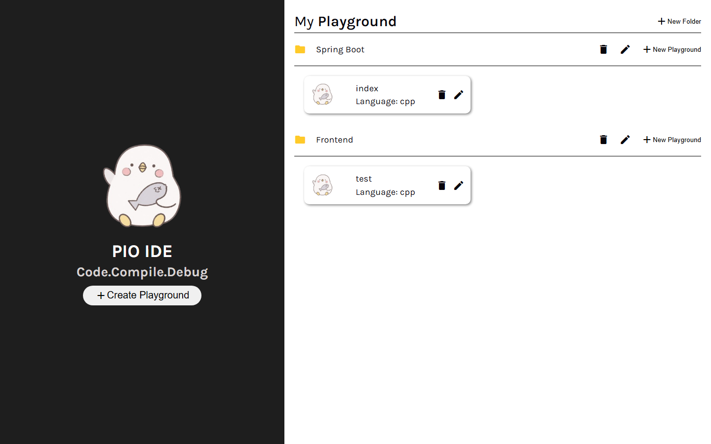
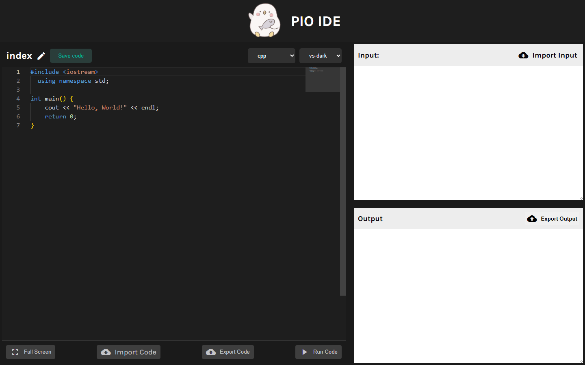

# 🐧 PIO IDE

브라우저에서 바로 코드를 작성하고 실행해보는 웹 기반 코드 플레이그라운드(IDE)입니다.
폴더 단위로 프로젝트를 정리하고, 파일마다 언어(C++ / Java / JavaScript / Python)를 선택해 [Judge0](https://judge0.com/) API로 즉시 컴파일·실행 결과를 확인할 수 있습니다.

<p>
  
  
  
  
  
  
</p>

## 📸 미리보기

|       홈 (플레이그라운드 목록)        |               코드 에디터 & 실행                |
| :-----------------------------------: | :---------------------------------------------: |
|  |  |

## ✨ 주요 기능

- **폴더/파일(플레이그라운드) 관리**: 폴더를 만들고 그 안에 파일을 추가·이름 변경·삭제하며 프로젝트처럼 코드를 정리
- **코드 에디터**: Monaco Editor 기반 문법 강조, `vs-dark` / `vs-light` 테마 전환, 전체화면 모드
- **실시간 코드 실행**: Judge0 CE API 연동으로 C++/Java/JavaScript/Python 코드를 서버에서 직접 컴파일·실행하고 stdin 입력에 대한 stdout/stderr 결과를 확인
- **가져오기 / 내보내기**: 로컬 파일에서 코드·입력값을 불러오거나, 작성한 코드/실행 결과를 텍스트 파일로 저장
- **자동 저장**: 폴더/파일 데이터를 `localStorage`에 동기화해 새로고침해도 작업 내용 유지

## 🛠️ 기술 스택

- **Frontend**: React 19, React Router 7
- **Editor**: Monaco Editor (`@monaco-editor/react`)
- **Build**: Vite 8, Babel + React Compiler 플러그인 (`babel-plugin-react-compiler`)
- **Styling**: Sass(SCSS)
- **외부 API**: Judge0 CE (RapidAPI) — 코드 실행 엔진
- **상태 관리**: React Context API (`PlaygroundProvider`, `ModalProvider`) + `localStorage`

## 🏗️ 아키텍처

```
src/
├── App.jsx                       # 라우팅(/ , /playground/:folderId/:fileId) 및 Provider 구성
├── Providers/
│   ├── PlaygroundProvider.jsx    # 폴더/파일 상태 관리(Context), localStorage 동기화
│   ├── ModalProvider.jsx         # 전역 모달 열림/닫힘 상태 관리
│   └── Modals/                   # 폴더/파일 생성·수정 모달 컴포넌트
├── pages/
│   ├── HomePage/                 # 플레이그라운드(폴더/파일) 목록 화면
│   └── PlaygroundPage/           # 코드 에디터 + 입출력 실행 화면
│       └── service.js            # Judge0 API 연동(제출 → 폴링 → 결과 반환)
├── hooks/useFileUpload.js        # 파일 업로드 공통 훅
└── utils/downloadTextFile.js     # 텍스트 파일 다운로드 유틸
```

두 개의 Context(`PlaygroundContext`, `ModalContext`)로 전역 상태를 분리했습니다. 플레이그라운드 데이터(폴더/파일/코드)는 `PlaygroundProvider`가, 모달의 열림 여부와 페이로드는 `ModalProvider`가 각각 책임지도록 관심사를 나눴습니다.

## 🐛 트러블슈팅: 언어 변경 시 에디터 코드가 한 박자 밀려서 반영되는 버그

**증상**: 에디터 상단에서 언어를 변경하면, 코드가 즉시 바뀌지 않고 그 다음 언어를 변경할 때 직전에 선택했던 언어의 기본 코드로 뒤늦게 바뀌었습니다.

**원인 분석**: `handleChangeLanguage` 핸들러가 아래 순서로 동작했습니다.

```js
updateLanguage(folderId, fileId, e.target.value); // setFolders 예약 (비동기)
setCode(getDefaultCode(folderId, fileId)); // 같은 틱에서 folders를 다시 읽음 → stale
```

`setFolders`는 즉시 반영이 아니라 다음 렌더링을 예약할 뿐이라, 같은 함수 실행 중에는 `folders`가 갱신되지 않습니다. `getDefaultCode(folderId, fileId)`가 Context의 `folders` state를 참조하는 함수였기 때문에, 이번 렌더에서 캡처된 **옛날 값**을 그대로 읽어오면서 한 클릭씩 밀리는 현상이 발생했습니다.

**해결**: "state를 쓰고 나서 다시 읽지 말고, 이미 알고 있는 값을 그대로 재사용"하는 방향으로 리팩터링했습니다.

- `getDefaultCode(folderId, fileId)`(파일별 코드 조회)를 `getDefaultCode(language)`로 변경해 `folders` state를 거치지 않고 언어만으로 기본 코드를 즉석에서 계산하도록 수정
- 언어 변경 핸들러도 새로 계산한 값을 그대로 `setCode`에 넘기도록 수정

```js
const handleChangeLanguage = (e) => {
  const defaultCode = getDefaultCode(e.target.value); // folders를 거치지 않고 즉석 계산
  setCode(defaultCode);
  setLanguage(e.target.value);
};
```

**배운 점**: React state는 해당 렌더링의 스냅샷이라, `setX(...)` 호출 직후 같은 함수 안에서 `x`를 다시 읽어도 갱신된 값이 아닙니다. "쓰고 바로 읽기"가 필요해 보이는 상황은 대개 이미 계산에 쓴 값을 재사용하면 해결됩니다.

## 🚀 시작하기

### 요구 사항

- Node.js (LTS 권장)

### 설치

```bash
npm install
```

### 환경 변수

코드 실행 기능은 RapidAPI의 [Judge0 CE API](https://rapidapi.com/judge0-official/api/judge0-ce)를 사용합니다. 프로젝트 루트에 `.env` 파일을 만들고 API 키를 채워주세요.

```
VITE_RAPIDAPI_API_KEY=your_rapidapi_key
```

### 실행

```bash
npm run dev       # 개발 서버
npm run build      # 프로덕션 빌드
npm run preview    # 빌드 결과 미리보기
npm run lint       # ESLint 검사
```

## 지원 언어

| 언어       | Judge0 language_id |
| ---------- | ------------------ |
| C++        | 54                 |
| Python     | 92                 |
| JavaScript | 93                 |
| Java       | 91                 |
